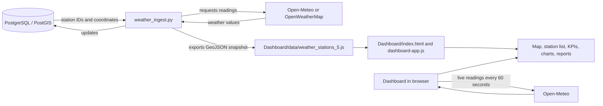

# FEWS Nigeria Project Guide

This guide is a map of the project: what each part does, how data reaches the dashboard, where common changes belong, and what to check when something stops working. It is not necessary to understand every line before making a small change; start with the file that owns the behavior.

## The Short Version

There are two related but separate ways weather data reaches the dashboard:

1. The browser loads the saved station snapshot in `Dashboard/data/weather_stations_5.js`, then requests current readings directly from Open-Meteo every 60 seconds. This path does not require PostgreSQL to display the dashboard.
2. `weather_ingest.py` reads station coordinates from PostgreSQL/PostGIS, requests readings from Open-Meteo or OpenWeatherMap, writes readings back to PostGIS, and exports a new snapshot to `Dashboard/data/weather_stations_5.js`.

The browser uses Leaflet for maps, Chart.js for graphs, and plain JavaScript for the dashboard behavior.



## Project Map

| Path                                                                              | Purpose                                                                                                               | Normally edit it?                                                 |
| --------------------------------------------------------------------------------- | --------------------------------------------------------------------------------------------------------------------- | ----------------------------------------------------------------- |
| [Weather Station Dashboard.qgz](Weather%20Station%20Dashboard.qgz)                | Native QGIS project. Open it in QGIS when changing GIS project layers or source data.                                 | Yes, through QGIS.                                                |
| [weather_ingest.py](weather_ingest.py)                                            | Python/PostGIS ingestion, API requests, updates, and dashboard snapshot export.                                       | Yes, for the database ingestion workflow.                         |
| [requirement.txt](requirement.txt)                                                | Python package requirements: psycopg2, requests, and python-dotenv.                                                   | Yes, when adding Python dependencies.                             |
| [.env.example](.env.example)                                                      | Safe template of database and API settings.                                                                           | Yes, copy its settings into your local `.env`.                    |
| `.env`                                                                            | Local database credentials and optional API key.                                                                      | Local machine only. Do not share or commit it.                    |
| [Dashboard/README.md](Dashboard/README.md)                                        | Dashboard features and quick-start notes.                                                                             | Yes, for user-facing run instructions.                            |
| [Dashboard/index.html](Dashboard/index.html)                                      | Page structure, script order, map creation, basemaps, overlays, and layer control.                                    | Yes, for page structure and map configuration.                    |
| [Dashboard/js/dashboard-app.js](Dashboard/js/dashboard-app.js)                    | Dashboard state and behavior: fetch, cards, markers, charts, reports, and downloads.                                  | Yes, for interactive behavior.                                    |
| [Dashboard/css/dashboard-pro.css](Dashboard/css/dashboard-pro.css)                | Main dashboard styling, responsive rules, map controls, markers, and popup theme.                                     | Yes, for appearance and layout.                                   |
| `Dashboard/data/*.js`                                                             | Geographic and weather data exposed as JavaScript variables. The weather file is also written by the Python exporter. | Usually regenerate via QGIS or ingestion instead of hand-editing. |
| `Dashboard/js/*.js` except `dashboard-app.js`                                     | Leaflet and other bundled libraries/plugins.                                                                          | Normally do not edit.                                             |
| `Dashboard/css/*.css` except `dashboard-pro.css`                                  | Leaflet, layer-tree, measurement, and Font Awesome library styles.                                                    | Normally do not edit.                                             |
| `Dashboard/images`, `Dashboard/markers`, `Dashboard/legend`, `Dashboard/webfonts` | Images, map marker assets, legends, and font files.                                                                   | Only when changing assets.                                        |

## How the Dashboard Starts

The script order in [Dashboard/index.html](Dashboard/index.html#L344) matters:

1. Leaflet and its plugins load first.
2. Geographic JavaScript data loads, including the station snapshot.
3. An inline script creates the Leaflet map, basemaps, boundaries, and layer selector.
4. [dashboard-app.js](Dashboard/js/dashboard-app.js#L23) initializes after the document is ready.

The app copies `json_weather_stations_5.features` into `WeatherPulse.stations`, renders the cards and KPIs, creates station markers, initializes the chart, requests live readings, and starts the countdown. If the live API is unreachable, cached snapshot values can still appear.

The HTML supplies the controls and containers; the JavaScript fills many of them dynamically. For example, the station card container is in [index.html](Dashboard/index.html#L161), while its contents are produced by [renderStationCards](Dashboard/js/dashboard-app.js#L652).

## Where to Look

### Map and GIS layers

In [Dashboard/index.html](Dashboard/index.html#L348):

- Map starting view: `fitBounds` immediately after `L.map`.
- Basemap URLs and attribution: the five basemap sections beginning around [line 388](Dashboard/index.html#L388). OSM Standard is the default; OSM International is the working Wikimedia alternative while the HOT tile host is unavailable.
- GeoJSON overlays: LGA, state, and national boundary setup around [line 456](Dashboard/index.html#L456), [line 478](Dashboard/index.html#L478), and [line 501](Dashboard/index.html#L501).
- Layer selector and its labels: [baseTree](Dashboard/index.html#L517), [overlaysTree](Dashboard/index.html#L551), and [layerControl](Dashboard/index.html#L577).

The basemap pane is z-index 200. The boundary panes are above it: LGA 402, states 403, national boundary 404. Keep overlay panes above basemaps or the raster tiles can cover your features. Turning an overlay on or off is done through the Layers control; the LGA layer is not necessarily enabled by default.

### Live data and station display

In [dashboard-app.js](Dashboard/js/dashboard-app.js#L8), `WeatherPulse` is the shared app state. It holds station features, marker references, selected station, refresh timer, current chart, and fetch status.

| Code landmark                                                                                                          | What it does                                                                                                                                  |
| ---------------------------------------------------------------------------------------------------------------------- | --------------------------------------------------------------------------------------------------------------------------------------------- |
| [initWeatherDashboard](Dashboard/js/dashboard-app.js#L23)                                                              | Loads the snapshot and starts the dashboard.                                                                                                  |
| [setupEventListeners](Dashboard/js/dashboard-app.js#L57)                                                               | Connects buttons, search, filters, tabs, and modal controls.                                                                                  |
| [createDynamicStationMarkers](Dashboard/js/dashboard-app.js#L204)                                                      | Creates a Leaflet marker for each station feature.                                                                                            |
| [createStationMarker](Dashboard/js/dashboard-app.js#L235) and [refreshMarkerIcons](Dashboard/js/dashboard-app.js#L292) | Build marker HTML and refresh it after new readings. If changing marker appearance or popup anchoring, keep both icon-building paths in sync. |
| [buildPopupHtml](Dashboard/js/dashboard-app.js#L354)                                                                   | Builds the station popup and its sensor readings/actions.                                                                                     |
| [fetchLiveWeatherData](Dashboard/js/dashboard-app.js#L490)                                                             | Calls Open-Meteo in the browser and updates station properties.                                                                               |
| [updateKPICards](Dashboard/js/dashboard-app.js#L572)                                                                   | Calculates the network summary values.                                                                                                        |
| [renderStationCards](Dashboard/js/dashboard-app.js#L652)                                                               | Builds the station list cards.                                                                                                                |
| [selectStation](Dashboard/js/dashboard-app.js#L746)                                                                    | Highlights a station and flies the map to its marker.                                                                                         |
| [filterStationCards](Dashboard/js/dashboard-app.js#L783) and [applyFilter](Dashboard/js/dashboard-app.js#L800)         | Search and alert-category filtering.                                                                                                          |
| [startRefreshTimer](Dashboard/js/dashboard-app.js#L819)                                                                | Starts the 60-second polling countdown.                                                                                                       |

Station geometries are GeoJSON Points, with coordinates ordered `[longitude, latitude]`. The app reads measurements from each feature's `properties`, such as `temperature`, `humidity`, `wind_speed`, `wind_direction`, `wind_gust`, `rain_rate`, `pressure`, and `heat_index`.

### Analytics, reports, and exports

- Chart startup and visual settings: [initAnalyticsChart](Dashboard/js/dashboard-app.js#L837).
- Chart series for temperature, wind, and humidity/pressure: [getChartData](Dashboard/js/dashboard-app.js#L899).
- Network downloads: [exportGeoJSON](Dashboard/js/dashboard-app.js#L999) and [exportCSV](Dashboard/js/dashboard-app.js#L1024).
- Station bulletin HTML and advisory thresholds: [openStationReport](Dashboard/js/dashboard-app.js#L1072).
- Single-station downloads: [downloadCurrentStationCSV](Dashboard/js/dashboard-app.js#L1281) and [downloadCurrentStationJSON](Dashboard/js/dashboard-app.js#L1333).

The popup, report, and card are separate renderers. If you add a new field, update each view where you want it shown, plus the relevant export.

### Styles

The main design system and base rules start in [dashboard-pro.css](Dashboard/css/dashboard-pro.css#L1). Responsive rules and Leaflet control styling follow. Later in the file there is an earlier light operations-console block at [line 2142](Dashboard/css/dashboard-pro.css#L2142), followed by the current dark map-console overrides at [line 3152](Dashboard/css/dashboard-pro.css#L3152). CSS rules later in the file win when selectors are equally specific, so edit the final dark-theme rules when a color change appears to have no effect.

The popup-specific rules start around [line 3480](Dashboard/css/dashboard-pro.css#L3480). Mobile popup sizing is at the end of the file. Vendor styles such as `leaflet.css` and `fontawesome-all.min.css` should normally be left alone.

## Python Ingestion Pipeline

The main pipeline is in [weather_ingest.py](weather_ingest.py):

| Code landmark                                                                                               | What it does                                                                                                    |
| ----------------------------------------------------------------------------------------------------------- | --------------------------------------------------------------------------------------------------------------- |
| [Configuration](weather_ingest.py#L47)                                                                      | Reads DB host, database, user, table, provider, and API key from environment settings.                          |
| [get_db_connection](weather_ingest.py#L68)                                                                  | Opens PostgreSQL and attempts a normalized database-name lookup if the requested name does not match exactly.   |
| [ensure_table_exists](weather_ingest.py#L172)                                                               | Creates the PostGIS extension/table when needed.                                                                |
| [get_stations](weather_ingest.py#L237)                                                                      | Reads station IDs/names and coordinates.                                                                        |
| [fetch_weather_open_meteo](weather_ingest.py#L270) / [fetch_weather_openweathermap](weather_ingest.py#L303) | Fetches and normalizes provider responses. Open-Meteo needs no API key; OpenWeatherMap does.                    |
| [update_postgis_station](weather_ingest.py#L347)                                                            | Updates columns that exist in the target table using parameterized SQL.                                         |
| [run_ingestion_cycle](weather_ingest.py#L411)                                                               | Runs one full pass over the stations, then exports the dashboard snapshot.                                      |
| [export_to_dashboard_geojson](weather_ingest.py#L487)                                                       | Writes `Dashboard/data/weather_stations_5.js` as a GeoJSON FeatureCollection assigned to a JavaScript variable. |
| [parse_arguments](weather_ingest.py#L547) / [main](weather_ingest.py#L590)                                  | CLI options and program entry point.                                                                            |

The exporter expects a PostGIS geometry column named `geom` to write point coordinates. The ingestion reader can also read latitude/longitude columns, but if you use that table shape, make sure the export query is updated too.

## Common Changes

| If you want to...                                       | Start here                                                                           | Also check                                                                                                           |
| ------------------------------------------------------- | ------------------------------------------------------------------------------------ | -------------------------------------------------------------------------------------------------------------------- |
| Change the page title, header labels, or control layout | [Dashboard/index.html](Dashboard/index.html)                                         | Matching IDs/classes in `dashboard-app.js` and styles in `dashboard-pro.css`.                                        |
| Change a basemap or its menu name                       | [Basemap setup](Dashboard/index.html#L388) and [baseTree](Dashboard/index.html#L517) | Keep the tile URL's attribution and max zoom accurate.                                                               |
| Add or restyle a map overlay                            | [Overlay setup](Dashboard/index.html#L456)                                           | Pane z-index, checked state in the layer tree, and tooltip fields.                                                   |
| Change station marker colors or labels                  | [createStationMarker](Dashboard/js/dashboard-app.js#L235)                            | [refreshMarkerIcons](Dashboard/js/dashboard-app.js#L292) and marker CSS near the end of the stylesheet.              |
| Change popup content                                    | [buildPopupHtml](Dashboard/js/dashboard-app.js#L354)                                 | Popup rules near [dashboard-pro.css line 3480](Dashboard/css/dashboard-pro.css#L3480).                               |
| Change station card fields                              | [renderStationCards](Dashboard/js/dashboard-app.js#L652)                             | Update CSS classes in `dashboard-pro.css`.                                                                           |
| Change KPI calculations                                 | [updateKPICards](Dashboard/js/dashboard-app.js#L572)                                 | The KPI element IDs in `index.html`.                                                                                 |
| Add a chart metric                                      | [fetchLiveWeatherData](Dashboard/js/dashboard-app.js#L490)                           | Update the source property, [getChartData](Dashboard/js/dashboard-app.js#L899), and any exports that need the field. |
| Change the weather provider or database schema          | [weather_ingest.py](weather_ingest.py#L47)                                           | `.env.example`, local `.env`, both API-normalizing functions, column mapping, table schema, and GeoJSON export.      |
| Add a dependency                                        | [requirement.txt](requirement.txt)                                                   | Install it in the Python environment used to run the script.                                                         |
| Change a boundary or station location in QGIS           | [Weather Station Dashboard.qgz](Weather%20Station%20Dashboard.qgz)                   | Regenerate the matching `Dashboard/data/*.js` export. The ingestion job overwrites only `weather_stations_5.js`.     |

When adding a weather field, trace it end to end: API response -> normalized property -> database column (if using ingestion) -> GeoJSON export -> card/popup/chart/report -> CSV or JSON export. Matching property names across those steps prevents blank fields.

## Running It

From the project root in PowerShell:

```powershell
python -m pip install -r requirement.txt
python -m http.server 8085 --directory "Dashboard"
```

Open `http://localhost:8085/index.html`. A local HTTP server is recommended because the dashboard loads multiple scripts and data files. Stop the server with `Ctrl+C` in its terminal.

The Python pipeline requires PostgreSQL with PostGIS reachable and a local `.env` configured:

```powershell
python weather_ingest.py --help
python weather_ingest.py --once
python weather_ingest.py --interval 300
```

`--once` runs one cycle. `--interval 300` keeps polling every five minutes until stopped with `Ctrl+C`. `--seed` adds the built-in sample stations if needed. Configure `DB_HOST`, `DB_PORT`, `DB_NAME`, `DB_USER`, `DB_PASSWORD`, and `DB_TABLE` in `.env`; for OpenWeatherMap, also set `WEATHER_API_PROVIDER=openweathermap` and `OPENWEATHER_API_KEY`. Never put credentials in source files or screenshots.

## Troubleshooting Guide

- **Page is blank or scripts/data return 404:** serve the `Dashboard` directory and open `/index.html`; do not serve the project root as if it were the web page.
- **Station list is empty:** check that `index.html` includes `data/weather_stations_5.js` before `js/dashboard-app.js`, and that the data variable contains a `features` array.
- **Cached readings show but do not update:** the browser requests Open-Meteo directly. Check network access and the browser console; this is independent of the database ingestion job.
- **The Python job cannot connect:** verify PostgreSQL is running, PostGIS is installed, and local `.env` values match the actual DB/table. `.env.example` is a template, not proof of your local database names.
- **Database values update but the dashboard is stale:** check the exporter log and modification time of `Dashboard/data/weather_stations_5.js`; the browser needs to reload the page to read a newly exported snapshot.
- **A basemap or overlay is missing:** open the Layers control, confirm the intended base layer is selected and the overlay checkbox is enabled, then check browser network errors and pane order in `index.html`.
- **A style edit seems ignored:** search for a later selector in `dashboard-pro.css`. The final dark-theme block overrides earlier theme declarations.
- **A marker change disappears after refresh:** update both `createStationMarker` and `refreshMarkerIcons`.

## Safe Editing Rules

1. Make the smallest edit in the owning file from the tables above.
2. Do not hand-edit minified Leaflet/plugin files or generated boundary data unless you intend to replace that generated output.
3. Keep station IDs unique and coordinates in longitude/latitude order in GeoJSON.
4. Keep `.env` private; share `.env.example` if someone needs the setting names.
5. After edits, reload the dashboard and test the affected control. For Python changes, run `python weather_ingest.py --help` for CLI parsing and use `--once` only when the database is configured.
